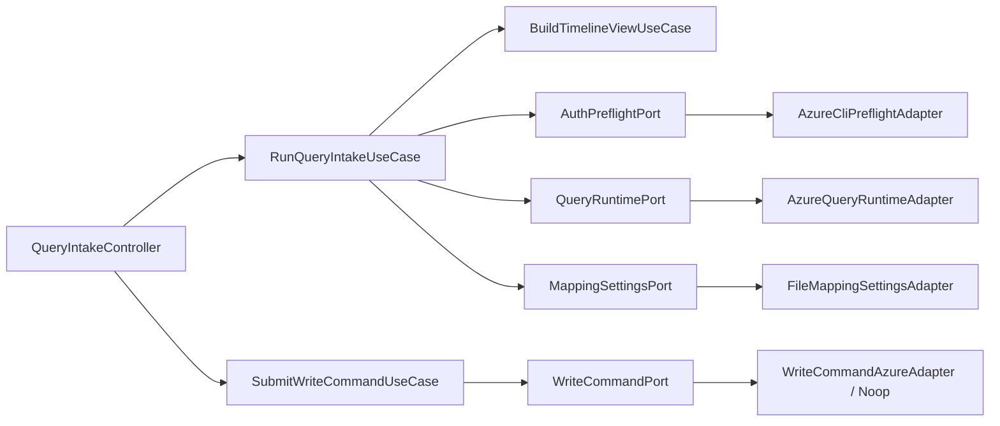

# C4 Component

## Core component view (Backend flow)

## Boundary rules

- `domain` and `application` do not import from `app`, `features`, or concrete adapters.
- Adapter contracts are defined in `application/ports`.
- Composition wiring happens in `app/composition`.
