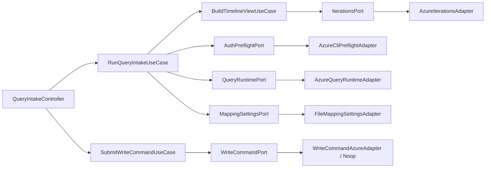

# C4 Component

## Core component view (Backend flow)

## Boundary rules

- `domain` and `application` do not import from `app`, `features`, or concrete adapters.
- Adapter contracts are defined in `application/ports`.
- Composition wiring happens in `app/composition`.

## Notable component responsibilities

- **`BuildTimelineViewUseCase`** validates the active mapping profile,
  builds the canonical model, projects bars/dependencies, and merges in
  iteration-fallback dates. It owns a single-slot iteration cache (60 s
  TTL) so repeated rebuilds within a UI session do not multiply REST
  traffic. See ADR 0004.
- **`AzureIterationsAdapter`** queries the
  `wit/classificationnodes/Iterations` endpoint with `$depth=10`,
  flattens the tree into `IterationMetadata[]` (full path + start/end
  attributes), and retries transient 429/503 responses with exponential
  backoff. 4xx responses fail fast; transport errors surface as
  `ITERATIONS_LIST_FAILED:<hint>`.
- **`projectTimeline`** in the planning-model domain emits an
  iteration-fallback item as a regular `TimelineBar` (with
  `missingBoundary: null`) so the UI does not need a separate code
  path. Items without explicit dates *and* without a matching dated
  iteration remain in `unschedulable`.
