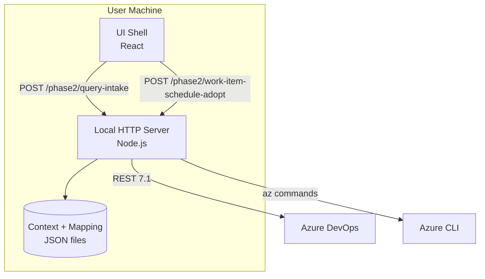

# C4 Container

## Containers

## Responsibilities

- UI Shell: interaction, state rendering, diagnostics surface.
- Local HTTP Server: composition root, transport validation, capability enforcement.
- Azure adapters: auth preflight, query runtime, write commands.
- Persistence adapters: context and mapping profile storage.
