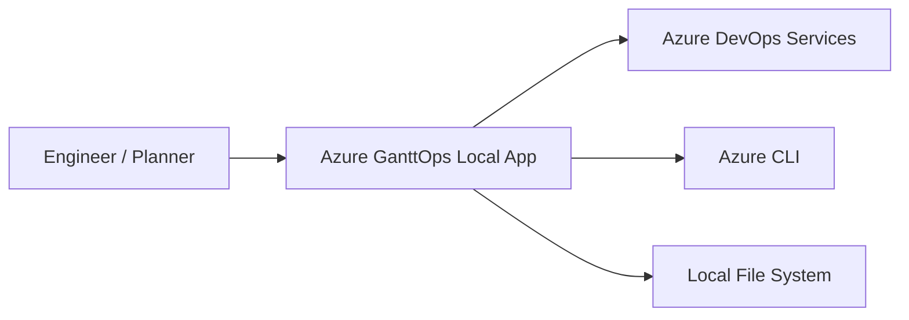

# C4 Context

## System Context

Azure GanttOps is a local-first application that reads Azure DevOps query results and renders a planning timeline.

## External systems

- Azure DevOps Services: query execution, work-item hydration, optional work-item patching.
- Azure CLI: local authentication/session and access token retrieval.
- Local file system: persisted context and mapping settings.

## Key constraints

- Core Azure calls run via local backend adapters, not direct browser token usage.
- Organization/project context is tenant-specific and user-configured.
- Runtime behavior is capability-driven (`writeEnabled`).
